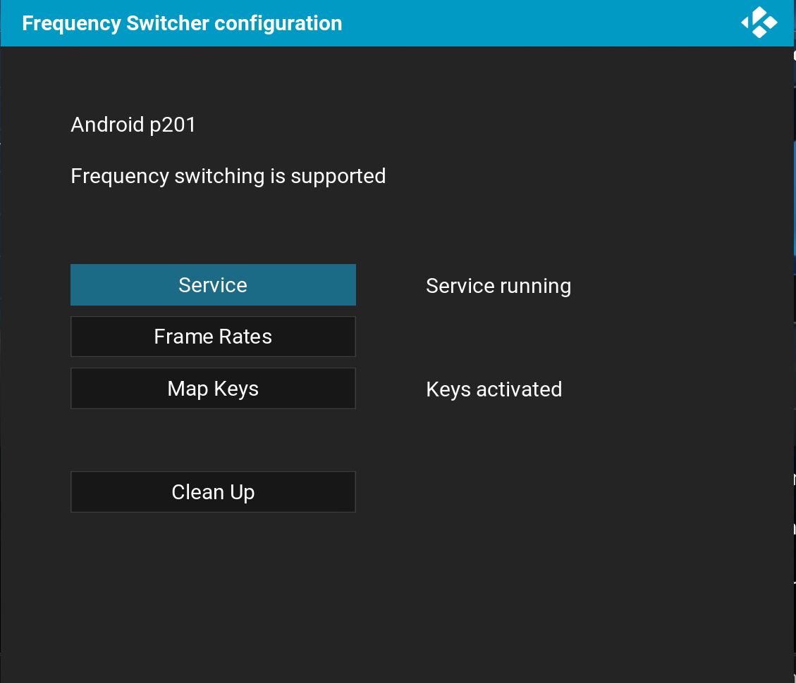
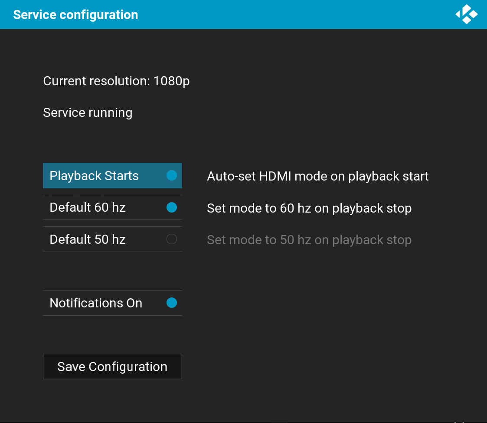
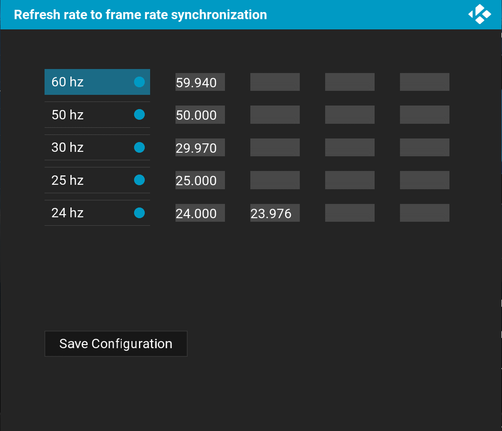

# Kodi.AmLogic.script.frequency.switcher
Automatic refresh rate switcher for Kodi running under Android in AmLogic boards (S802 based, mainly)

Based on the Minix Frequency Switcher:
(http://www.minixforum.com/threads/autoframerate-detection-switching-output-in-xbmc.601/)

- Modified to run on all AmLogic boards.
- Modified to run on Kodi instead of XBMC.

/sys/class/display/mode needs to be writable.

With Kodi supporting automatic rate switching, this addon in useful mainly for S802 boards that can't perform HDMI handshake,
resulting in "null edid" in /sys/class/amhdmitx/amhdmitx0/disp_cap

Kodi uses information in that virtual file to determine valid resolutions/refresh rates.
Submited PR to Kodi to support manual override of "disp_cap" to try to circumvent the issue: https://github.com/xbmc/xbmc/pull/7257

### Screenshot
    
